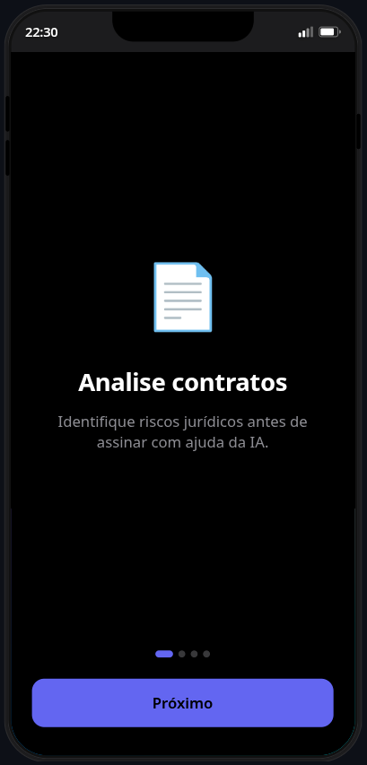
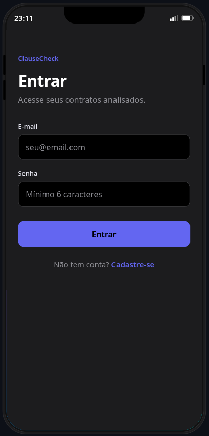
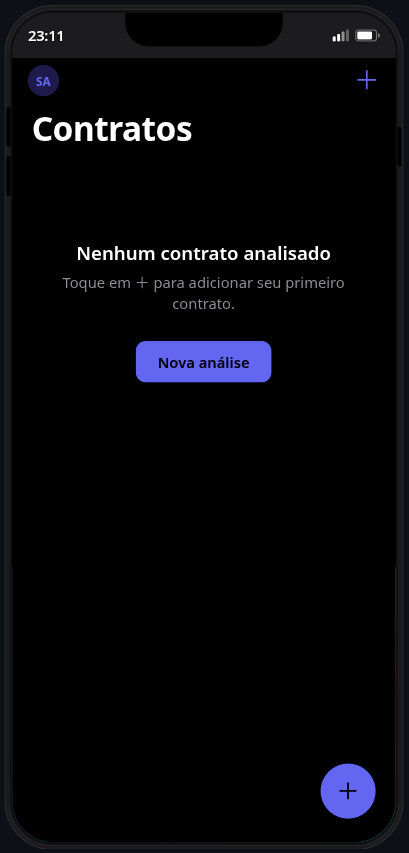
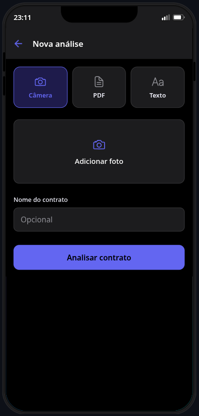
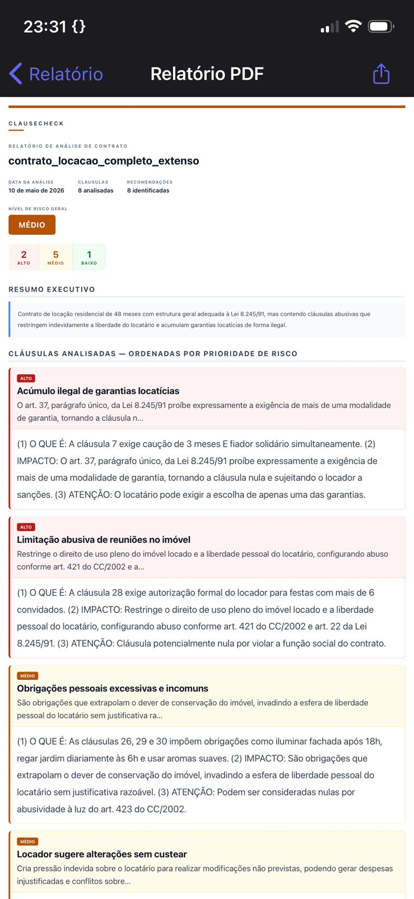
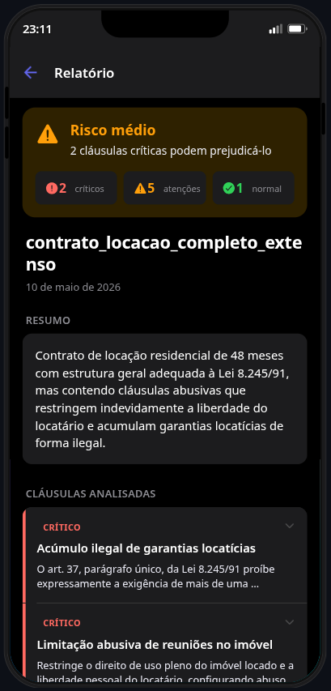
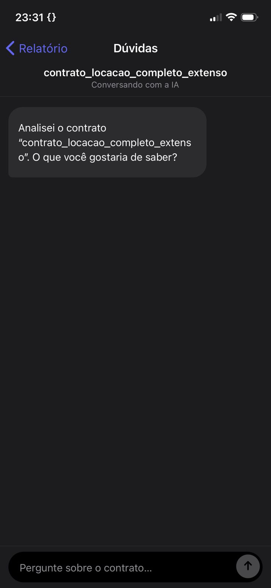
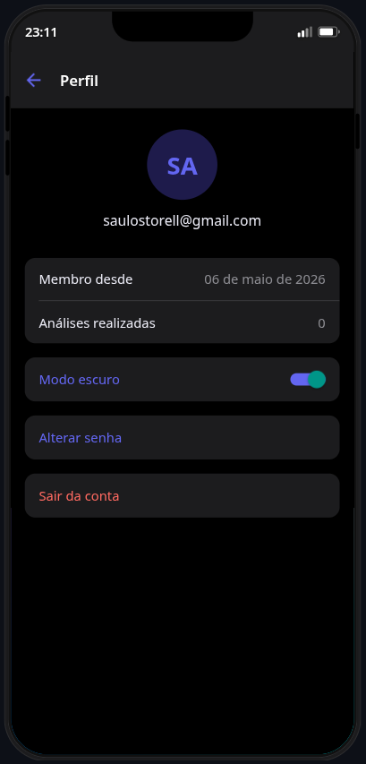

# ⚖️ ClauseCheck

> Analise qualquer contrato com Inteligência Artificial. Foto ou texto — resultado em segundos.

---

## 📱 Sobre o Projeto

O **ClauseCheck** é um aplicativo mobile desenvolvido em React Native que permite ao usuário analisar contratos de forma simples e acessível. A maioria dos brasileiros assina contratos sem entendê-los por falta de acesso a assessoria jurídica. O ClauseCheck resolve isso: basta fotografar o contrato ou colar o texto, e a IA identifica cláusulas abusivas, explica cada ponto em linguagem simples e ainda fica disponível para tirar dúvidas via chat.

**Disciplina:** Desenvolvimento para Dispositivos Móveis — AV2  
**Professor:** Igor Revoredo  
**Período:** 3º Período  

---

## 🚀 Funcionalidades

- 📷 **Análise por foto** — fotografe o contrato impresso, Claude lê a imagem diretamente
- 📝 **Análise por texto** — cole o conteúdo do contrato e receba o relatório
- 🔴🟡🟢 **Relatório com semáforo de risco** — cláusulas classificadas por nível de perigo
- 💬 **Chat jurídico contextual** — tire dúvidas específicas sobre o contrato com a IA
- 🗂️ **Histórico de análises** — todos os contratos analisados ficam salvos
- 🔐 **Autenticação segura** — login e cadastro via Supabase Auth

---

## 🛠️ Tecnologias Utilizadas

| Tecnologia | Versão | Finalidade |
|---|---|---|
| [React Native](https://reactnative.dev/) | 0.81.5 | Framework mobile |
| [Expo](https://expo.dev/) | 54.0.0 | Toolchain e build |
| [React Navigation](https://reactnavigation.org/) | 7.2.2 | Navegação entre telas |
| [React](https://react.dev/) | 19.1.0 | Biblioteca de UI |
| [Supabase](https://supabase.com/) | 2.105.3 | Autenticação, banco de dados e Edge Functions |
| [Claude API (Anthropic)](https://www.anthropic.com/) | via Edge Functions | Análise de contratos e chat com IA |
| [@ronradtke/react-native-markdown-display](https://github.com/ronradtke/react-native-markdown-display) | 8.1.0 | Renderização de markdown |
| [expo-image-picker](https://docs.expo.dev/versions/latest/sdk/imagepicker/) | 17.0.11 | Câmera e galeria |
| [expo-file-system](https://docs.expo.dev/versions/latest/sdk/filesystem/) | 19.0.22 | Acesso ao sistema de arquivos |
| [expo-document-picker](https://docs.expo.dev/versions/latest/sdk/documentpicker/) | 14.0.8 | Seletor de documentos |
| [expo-sharing](https://docs.expo.dev/versions/latest/sdk/sharing/) | 14.0.8 | Compartilhamento de arquivos |
| [expo-print](https://docs.expo.dev/versions/latest/sdk/print/) | 15.0.8 | Impressão e PDF |
| [expo-haptics](https://docs.expo.dev/versions/latest/sdk/haptics/) | 15.0.8 | Feedback tátil |
| [TypeScript](https://www.typescriptlang.org/) | 5.9.2 | Tipagem estática |

---

## ✅ Componentes React Native Utilizados

| Componente | Uso |
|---|---|
| `View` | Estrutura de layout de todas as telas |
| `Text` | Títulos, descrições, cláusulas, mensagens do chat |
| `TextInput` | Campos de login, texto do contrato e input do chat |
| `TouchableOpacity` / `Button` | Botões de ação em todas as telas |
| `FlatList` | Histórico de contratos, lista de cláusulas e mensagens do chat |
| `ScrollView` | Conteúdo em telas com muito texto (relatório, PDF preview) |
| `Image` | Logo, preview de foto do contrato |
| `ActivityIndicator` | Loading durante análise e busca de dados |
| **Flexbox Layout** | Layout responsivo de todas as telas |
| **React Navigation Stack** | 8 telas conectadas com roteamento seguro |

---

## 📲 Telas do Aplicativo

| # | Tela | Descrição |
|---|---|---|
| 1 | **Onboarding** | Boas-vindas e apresentação da plataforma para novos usuários |
| 2 | **Login / Cadastro** | Autenticação com e-mail e senha via Supabase |
| 3 | **Home (Histórico)** | Lista de todos os contratos já analisados com badge de risco |
| 4 | **Nova Análise** | Envio do contrato por foto (câmera/galeria), documento ou texto |
| 5 | **Relatório** | Resultado com risco geral, cláusulas classificadas e recomendações |
| 6 | **Prévia PDF** | Visualização de PDF antes de enviar para análise |
| 7 | **Chat** | Conversa contextual com a IA sobre o contrato analisado |
| 8 | **Perfil** | Configurações do usuário e gerenciamento da conta |

---

## 🗄️ Banco de Dados — Supabase

**Tabela `analyses`** — armazena cada contrato analisado  
**Tabela `messages`** — armazena o histórico de chat por contrato  
Row Level Security ativado: cada usuário acessa apenas seus próprios dados.

---

## ⚙️ Instalação e Execução

### O que você precisa instalar

| Ferramenta | Versão mínima | Como instalar |
|---|---|---|
| [Node.js](https://nodejs.org/) | 18+ | Download no site oficial ou via `nvm` |
| [npm](https://www.npmjs.com/) | Incluso no Node.js | — |
| [Supabase CLI](https://supabase.com/docs/guides/cli) | Última | `npm install -g supabase` |
| [Expo Go](https://expo.dev/go) | Última | App Store / Google Play no celular |

Além disso, você precisa ter:
- Conta gratuita no [Supabase](https://supabase.com/)
- Chave de API da [Anthropic](https://console.anthropic.com/) para as Edge Functions

---

### 1. Clonar o repositório

```bash
git clone https://github.com/SauloStorel/clausecheck.git
cd clausecheck
```

### 2. Instalar dependências

```bash
npm install
```

### 3. Configurar variáveis de ambiente

```bash
cp .env.example .env
```

Edite o `.env` com as credenciais do seu projeto Supabase (encontradas em **Project Settings → API**):

```env
EXPO_PUBLIC_SUPABASE_URL=https://seu-projeto.supabase.co
EXPO_PUBLIC_SUPABASE_ANON_KEY=sua-anon-key
```

### 4. Criar as tabelas no Supabase

Acesse seu projeto no Supabase → **SQL Editor** e execute:

```sql
-- Tabela de análises
create table analyses (
  id uuid primary key default gen_random_uuid(),
  user_id uuid references auth.users not null,
  title text not null default 'Contrato sem título',
  input_text text,
  image_url text,
  report jsonb,
  risk_level text check (risk_level in ('high', 'medium', 'low')),
  created_at timestamptz default now()
);
alter table analyses enable row level security;
create policy "user_analyses" on analyses for all using (auth.uid() = user_id);

-- Tabela de mensagens do chat
create table messages (
  id uuid primary key default gen_random_uuid(),
  analysis_id uuid references analyses(id) on delete cascade not null,
  role text check (role in ('user', 'assistant')) not null,
  content text not null,
  created_at timestamptz default now()
);
alter table messages enable row level security;
create policy "user_messages" on messages for all using (
  exists (select 1 from analyses where analyses.id = messages.analysis_id and analyses.user_id = auth.uid())
);
```

### 5. Fazer deploy das Edge Functions

As Edge Functions ficam na pasta `supabase/functions/` e são responsáveis por chamar a API da Anthropic com segurança (a chave nunca fica exposta no app).

**5.1 — Login no Supabase CLI**
```bash
supabase login
```

**5.2 — Vincular ao seu projeto**
```bash
supabase link --project-ref SEU_PROJECT_REF
```
> O `PROJECT_REF` está na URL do seu projeto: `https://supabase.com/dashboard/project/SEU_PROJECT_REF`

**5.3 — Configurar a chave da Anthropic como secret**
```bash
supabase secrets set ANTHROPIC_API_KEY=sua-chave-anthropic
```

**5.4 — Fazer o deploy das funções**
```bash
supabase functions deploy analyze-contract
supabase functions deploy chat-contract
```

### 6. Rodar o app

```bash
npx expo start
```

Escaneie o QR Code com o **Expo Go** no celular.

---

## 👥 Integrantes e Contribuições

| Membro | Responsabilidade |
|---|---|
| Saulo José Storel de Moura Abreu | Desenvolvimento completo do app — todas as telas, componentes, serviços e integrações |

---

## 🤝 Como Contribuir

Contribuições são bem-vindas! Para contribuir:

1. **Fork** o repositório
2. Crie uma **branch** para sua feature (`git checkout -b feature/melhoria`)
3. **Commit** suas mudanças (`git commit -m 'Add: nova funcionalidade'`)
4. **Push** para a branch (`git push origin feature/melhoria`)
5. Abra um **Pull Request**

### Diretrizes
- Siga o padrão de commits: `feat:`, `fix:`, `docs:`, `refactor:`, `test:`
- Adicione testes para novas funcionalidades
- Atualize o README se necessário
- Mantenha a compatibilidade com React Native

---

## 🔒 Segurança

Se você descobrir uma vulnerabilidade, **não abra uma issue pública**. Leia nossa [Política de Segurança](SECURITY.md) para mais detalhes.

---

## 📸 Prints das Telas

<table>
  <tr>
    <td align="center"><b>Onboarding</b></td>
    <td align="center"><b>Login</b></td>
    <td align="center"><b>Histórico</b></td>
    <td align="center"><b>Nova Análise</b></td>
  </tr>
  <tr>
    <td></td>
    <td></td>
    <td></td>
    <td></td>
  </tr>
</table>

<table>
  <tr>
    <td align="center"><b>PDF Preview</b></td>
    <td align="center"><b>Relatório</b></td>
    <td align="center"><b>Chat</b></td>
    <td align="center"><b>Perfil</b></td>
  </tr>
  <tr>
    <td></td>
    <td></td>
    <td></td>
    <td></td>
  </tr>
</table>

> 📌 Para adicionar os prints: crie a pasta `assets/screenshots/` e adicione as imagens com os nomes acima.

---

## 🏗️ Estrutura do Projeto

```
clausecheck/
├── src/
│   ├── screens/
│   │   ├── OnboardingScreen.tsx  # Boas-vindas e introdução
│   │   ├── LoginScreen.tsx       # Login e cadastro
│   │   ├── HomeScreen.tsx        # Página inicial
│   │   ├── HistoricoScreen.tsx   # Histórico de contratos analisados
│   │   ├── NovaAnaliseScreen.tsx # Envio do contrato (foto/texto/PDF)
│   │   ├── RelatorioScreen.tsx   # Resultado da análise com cláusulas
│   │   ├── PDFPreviewScreen.tsx  # Prévia de PDF antes da análise
│   │   ├── ChatScreen.tsx        # Chat contextual com a IA
│   │   └── PerfilScreen.tsx      # Perfil e configurações do usuário
│   ├── components/
│   │   ├── RiskBadge.tsx         # Badge 🔴🟡🟢 de risco
│   │   ├── ClauseCard.tsx        # Card expansível de cláusula
│   │   ├── MessageBubble.tsx     # Bolha de mensagem do chat
│   │   └── AnalysisItem.tsx      # Item da lista de histórico
│   ├── services/
│   │   ├── supabase.ts           # Cliente Supabase (auth, DB)
│   │   └── claude.ts             # Integração com Edge Functions
│   ├── constants/
│   │   └── prompts.ts            # Prompts do sistema para a IA
│   └── types/
│       └── index.ts              # Tipos TypeScript globais
├── App.tsx                       # Navegação e configuração principal
├── .env.example                  # Modelo de variáveis de ambiente
├── .supabase/                    # Configurações do Supabase
├── package.json                  # Dependências do projeto
└── README.md
```

---

## 📄 Licença

Este projeto está licenciado sob a [MIT License](LICENSE) — veja o arquivo `LICENSE` para detalhes.

---

## 📞 Contato e Suporte

- **GitHub Issues:** Para bugs e sugestões de features
- **Email:** saulostorell@gmail.com
- **Segurança:** Veja [SECURITY.md](SECURITY.md)
