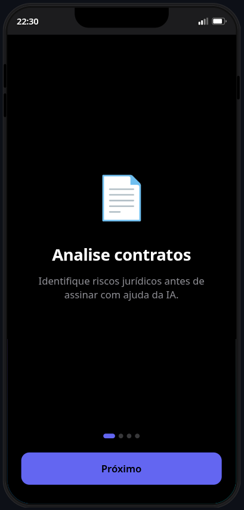
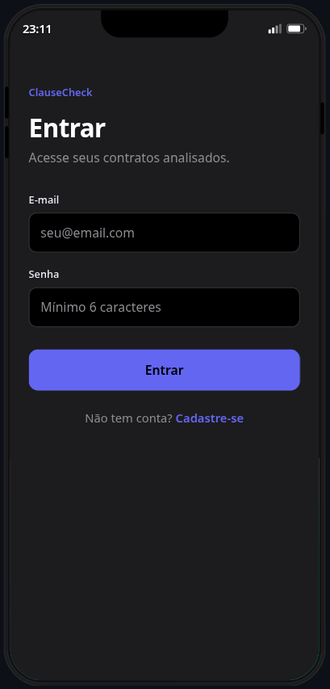
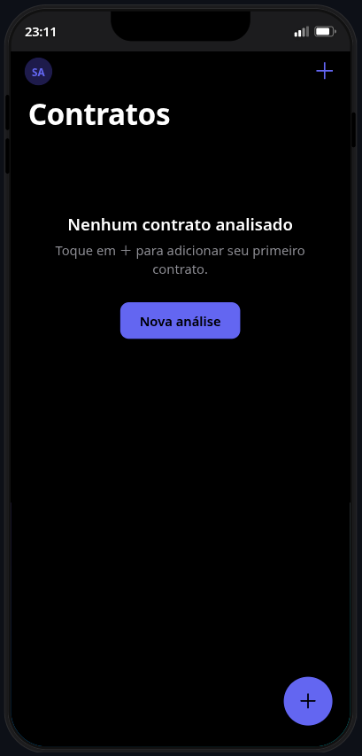
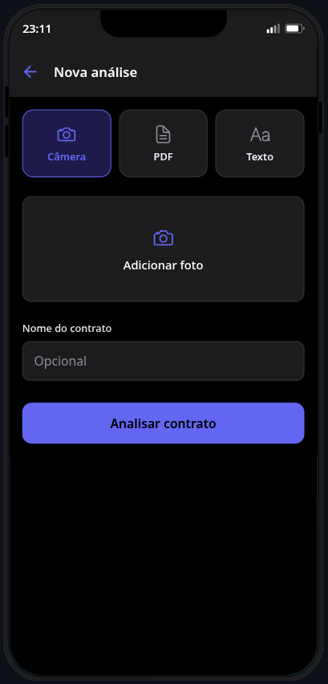
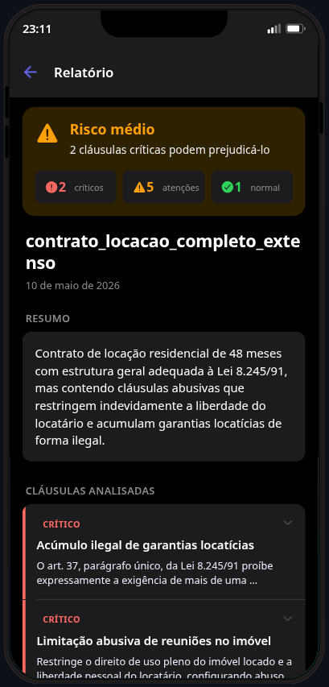
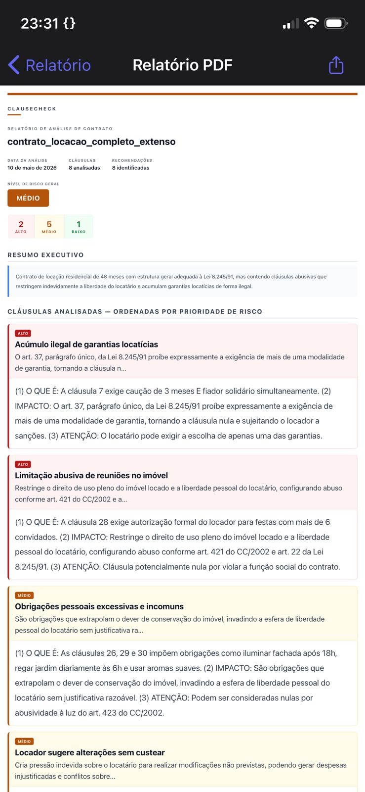
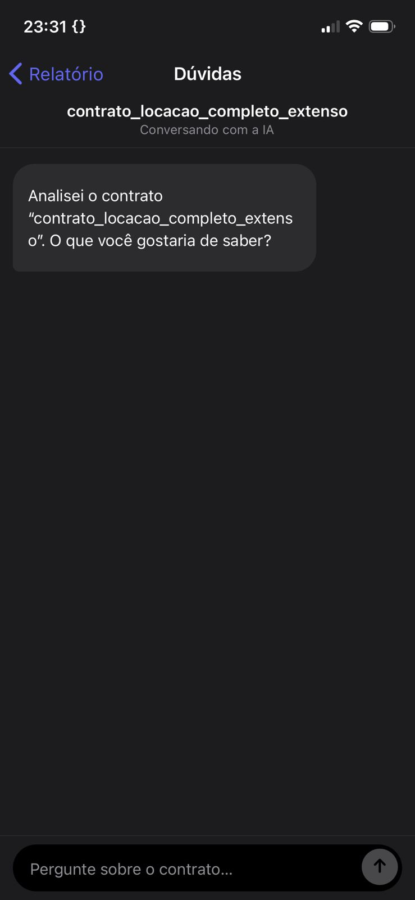
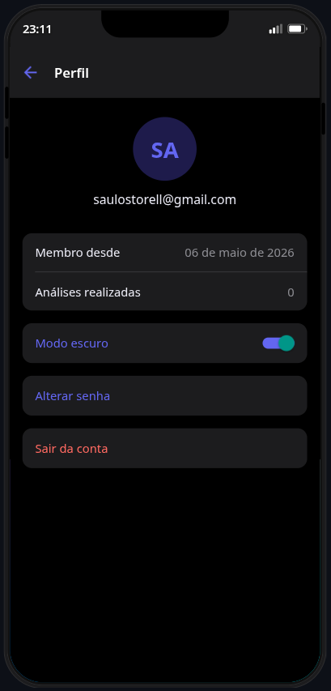
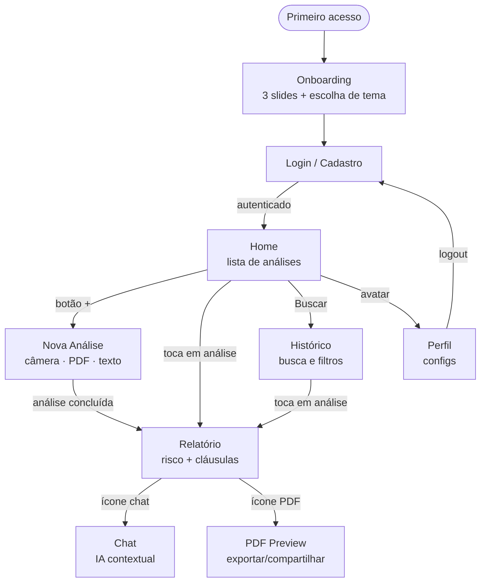

# ClauseCheck — Documentação do Aplicativo

**Disciplina:** Desenvolvimento para Dispositivos Móveis  
**Professor:** Igor Revoredo  
**Período:** 3º Período  
**Aluno:** Saulo José Storel de Moura Abreu  
**Data:** Junho de 2026

---

## Sumário

1. [Objetivos do Projeto](#1-objetivos-do-projeto)
2. [Funcionalidades Principais](#2-funcionalidades-principais)
3. [Tipos de Usuário](#3-tipos-de-usuário)
4. [Telas do Aplicativo](#4-telas-do-aplicativo)
5. [Navegação Entre Telas](#5-navegação-entre-telas)
6. [Fluxo de Utilização](#6-fluxo-de-utilização)
7. [Planejamento de Expansão](#7-planejamento-de-expansão)
8. [Banco de Dados](#8-banco-de-dados)
9. [Proposta de Backend — Rotas de API](#9-proposta-de-backend--rotas-de-api)

---

## 1. Objetivos do Projeto

### 1.1 O Problema

A maioria dos brasileiros assina contratos — de aluguel, de emprego, de serviços, de financiamento — sem compreender plenamente o que está concordando. Isso não é falta de inteligência: é falta de acesso. Uma consulta com advogado custa caro e leva tempo. O resultado prático é que cláusulas abusivas passam despercebidas, gerando prejuízos financeiros e legais que poderiam ser evitados.

### 1.2 A Solução

O **ClauseCheck** é um aplicativo mobile que democratiza o acesso à análise jurídica. Com ele, qualquer pessoa pode fotografar um contrato impresso, enviar um PDF ou colar o texto — e receber em segundos um relatório completo, em linguagem simples, identificando cláusulas problemáticas e seus riscos.

O app usa inteligência artificial (Claude Opus da Anthropic) combinada com uma base de dados jurídica real (Código Civil, CDC, CLT e Lei do Inquilinato), garantindo análises fundamentadas na legislação brasileira vigente.

### 1.3 Público-Alvo

- Cidadãos comuns que precisam analisar contratos do cotidiano
- Estudantes e pesquisadores de direito
- Pequenos empreendedores que lidam com contratos fornecedores/clientes
- Qualquer pessoa que deseje entender seus direitos antes de assinar um documento

### 1.4 Tecnologias Utilizadas

| Camada | Tecnologia |
|---|---|
| Mobile | React Native + Expo (TypeScript) |
| Autenticação | Supabase Auth |
| Banco de Dados | PostgreSQL (Supabase) + pgvector |
| Backend | Supabase Edge Functions (Deno) |
| Inteligência Artificial | Claude Opus 4.6 (Anthropic) |
| RAG (base jurídica) | Voyage AI (voyage-law-2) + pgvector |

---

## 2. Funcionalidades Principais

### 2.1 Análise de Contratos por Três Modalidades

O usuário pode enviar o contrato de três formas diferentes:

- **Por Foto (Câmera):** Aponta a câmera do celular para o contrato impresso e tira quantas fotos forem necessárias para cobrir todas as páginas. O app envia as imagens diretamente para a IA, que as lê e analisa.
- **Por PDF:** Seleciona um arquivo PDF do dispositivo. Ideal para contratos digitais recebidos por e-mail.
- **Por Texto:** Cola o conteúdo textual do contrato diretamente em um campo de entrada. Útil para contratos em formato digital editável.

### 2.2 Relatório com Semáforo de Risco

Após a análise, o app gera um relatório estruturado com:

- **Nível de risco geral** do contrato: alto (🔴), médio (🟡) ou baixo (🟢)
- **Resumo executivo** em linguagem acessível (2 frases)
- **Lista de cláusulas identificadas**, cada uma com:
  - Classificação de risco individual
  - Título descritivo (até 6 palavras)
  - Explicação em três partes: *O que é*, *Impacto prático* e *O que você deve saber*
  - Indicação se a cláusula afeta ambas as partes ou só uma delas
  - Nota de gravidade (apenas para cláusulas de alto risco)
- **Recomendações práticas** para o usuário antes de assinar

### 2.3 Chat Jurídico Contextual

Após receber o relatório, o usuário pode abrir um chat com a IA e fazer perguntas específicas sobre o contrato que acabou de analisar. A IA responde com conhecimento do contexto daquele contrato específico, citando artigos do Código Civil e de outras legislações quando relevante. O histórico da conversa é salvo e pode ser consultado novamente.

### 2.4 Histórico de Análises

Todos os contratos analisados ficam salvos no histórico do usuário. A tela de histórico permite:

- Buscar contratos por título
- Filtrar por nível de risco (alto, médio, baixo)
- Ordenar por data (mais recente ou mais antigo)
- Excluir análises antigas

### 2.5 RAG Jurídico (Retrieval-Augmented Generation)

O app não depende apenas do conhecimento geral da IA. Antes de cada análise, o sistema busca automaticamente os artigos de lei mais relevantes para aquele contrato específico e os injeta no contexto da IA. Isso garante que as análises sejam fundamentadas na legislação brasileira real:

- **CC/2002** — Código Civil Brasileiro
- **CDC** — Código de Defesa do Consumidor
- **CLT** — Consolidação das Leis do Trabalho
- **Lei do Inquilinato** — Lei 8.245/91

### 2.6 Autenticação Segura

O app exige autenticação para funcionar. O usuário cria uma conta com e-mail e senha, recebe um e-mail de confirmação, e seus dados ficam isolados dos demais usuários (nenhum usuário vê os contratos ou análises de outro).

Recursos disponíveis: login, cadastro, redefinição de senha por e-mail e logout.

### 2.7 Tema Claro e Escuro

O usuário escolhe o tema visual preferido já na tela de onboarding e pode alterá-lo a qualquer momento na tela de perfil. O tema é salvo localmente no dispositivo.

### 2.8 Exportação de Relatório em PDF

O relatório de qualquer análise pode ser exportado como PDF e compartilhado via qualquer aplicativo do dispositivo (WhatsApp, e-mail, Google Drive, etc.).

---

## 3. Tipos de Usuário

O ClauseCheck, em sua versão atual, possui um único tipo de usuário:

### Usuário Autenticado

Qualquer pessoa que realize cadastro no app. Após a autenticação, o usuário tem acesso completo a todas as funcionalidades:

- Criar e visualizar suas próprias análises
- Conversar via chat sobre seus contratos
- Exportar relatórios em PDF
- Gerenciar seu histórico
- Alterar preferências de tema e senha

**Isolamento de dados:** Cada usuário vê apenas seus próprios contratos e conversas. Isso é garantido por Row Level Security no banco de dados — nenhuma query retorna dados de outro usuário, mesmo que alguém tente acessar por força bruta.

> **Nota para expansão futura:** O planejamento de expansão (Seção 7) inclui a proposta de um papel de **Advogado Revisor**, que teria acesso a análises de clientes para revisão profissional. Isso exigiria um sistema de roles e permissões adicionais.

---

## 4. Telas do Aplicativo

### 4.1 Tela de Onboarding



**Finalidade:** Apresentar o app ao usuário na primeira vez que ele abre o ClauseCheck.

**Descrição:** Exibe 3 slides educativos sequenciais, cada um com ícone, título e descrição curta explicando o que o app faz. No final do último slide, o usuário escolhe entre tema claro ou escuro antes de prosseguir.

**Ações disponíveis:**
- Avançar entre os slides
- Selecionar tema (claro ou escuro)
- Tocar em "Começar" para ir à tela de login

**Navegação:** → Login (após tocar em "Começar")

---

### 4.2 Tela de Login / Cadastro



**Finalidade:** Autenticar o usuário ou criar uma nova conta.

**Descrição:** Exibe campos de e-mail e senha. Permite alternar entre os modos Login e Cadastro. No modo cadastro, exibe um campo adicional de confirmação de senha. Erros de autenticação são exibidos em português.

**Ações disponíveis:**
- Entrar com e-mail e senha (Login)
- Criar nova conta (Cadastro)
- Redefinir senha por e-mail
- Alternar entre os modos Login ↔ Cadastro

**Navegação:** → Home (após login bem-sucedido)

---

### 4.3 Tela Home (Dashboard)



**Finalidade:** Ponto central do app. Exibe os contratos analisados pelo usuário e dá acesso às principais funcionalidades.

**Descrição:** Lista os contratos analisados com título, nível de risco (badge colorido) e data. Cada item pode ser deslizado (swipe) para revelar a opção de exclusão. No topo, há o cabeçalho com o nome do usuário e um atalho para o perfil. No canto inferior direito, botão de ação flutuante (+) para iniciar nova análise.

**Ações disponíveis:**
- Tocar em um contrato → ver relatório
- Deslizar item para a esquerda → excluir análise
- Tocar no botão (+) → iniciar nova análise
- Tocar no avatar do usuário → ir para Perfil
- Tocar em "Buscar" → ir para Histórico

**Navegação:** → Nova Análise, → Relatório, → Histórico, → Perfil

---

### 4.4 Tela de Nova Análise



**Finalidade:** Permitir que o usuário envie um contrato para ser analisado pela IA.

**Descrição:** Apresenta três botões de modalidade no topo (Câmera, PDF, Texto). Ao selecionar uma modalidade, o conteúdo da tela muda para o método de entrada correspondente. Um campo de título permite nomear o contrato. Ao iniciar a análise, um overlay de carregamento exibe uma barra de progresso e dicas jurídicas rotativas enquanto a IA processa.

**Ações disponíveis:**
- Selecionar modalidade de entrada (câmera / PDF / texto)
- Capturar fotos do contrato pela câmera
- Selecionar arquivo PDF do dispositivo
- Digitar ou colar o texto do contrato
- Digitar título para o contrato
- Tocar em "Analisar" → iniciar análise

**Navegação:** → Relatório (após análise concluída)

---

### 4.5 Tela de Relatório



**Finalidade:** Exibir o resultado completo da análise do contrato.

**Descrição:** Mostra o nível de risco geral com badge colorido destacado, contadores por nível de risco (ex: "2 alto · 3 médio · 1 baixo"), o resumo executivo, a lista de cláusulas identificadas (expansíveis individualmente) e as recomendações ao final. Botões no topo permitem acessar o chat ou o PDF do relatório.

**Ações disponíveis:**
- Expandir/recolher cada cláusula para ler a explicação completa
- Tocar no ícone de chat → abrir Chat
- Tocar no ícone de PDF → abrir PDF Preview

**Navegação:** → Chat, → PDF Preview

---

### 4.6 Tela de PDF Preview



**Finalidade:** Exibir uma versão formatada do relatório no estilo de documento PDF para visualização e exportação.

**Descrição:** Renderiza o relatório em HTML dentro de um WebView, com formatação de documento (cabeçalho, colunas, cores por nível de risco). Um botão no topo direito abre o menu nativo de compartilhamento do dispositivo.

**Ações disponíveis:**
- Rolar o documento (scroll)
- Tocar no ícone de compartilhamento → exportar/compartilhar PDF

**Navegação:** Sem navegação para novas telas (tela terminal)

---

### 4.7 Tela de Chat



**Finalidade:** Permitir conversa com a IA sobre dúvidas específicas do contrato analisado.

**Descrição:** Interface de chat com bolhas de mensagem (usuário à direita, IA à esquerda). O campo de texto fica na parte inferior, com teclado que sobe sem sobrepor o input. O histórico completo da conversa é exibido na lista. A IA tem contexto do contrato analisado e das mensagens anteriores.

**Ações disponíveis:**
- Digitar uma pergunta sobre o contrato
- Enviar mensagem
- Rolar o histórico de conversa

**Navegação:** Sem navegação para novas telas (tela terminal)

---

### 4.8 Tela de Histórico


**Finalidade:** Buscar e filtrar entre todos os contratos já analisados pelo usuário.

**Descrição:** Apresenta campo de busca por título no topo, seguido de filtros por nível de risco (chips clicáveis: Alto, Médio, Baixo) e controle de ordenação. A lista de contratos abaixo atualiza em tempo real conforme os filtros são aplicados. Cada item pode ser deslizado para exclusão.

**Ações disponíveis:**
- Buscar contratos por título
- Filtrar por nível de risco
- Alternar ordenação (mais recente / mais antigo)
- Tocar em um contrato → ver relatório
- Deslizar item para a esquerda → excluir análise

**Navegação:** → Relatório

---

### 4.9 Tela de Perfil



**Finalidade:** Exibir informações da conta do usuário e permitir configurações pessoais.

**Descrição:** Exibe e-mail cadastrado, data de adesão ao app e quantidade total de análises realizadas. Contém switches e botões para configurações: alternar tema claro/escuro, redefinir senha e sair da conta.

**Ações disponíveis:**
- Alternar tema claro/escuro
- Tocar em "Redefinir Senha" → receber e-mail de redefinição
- Tocar em "Sair" → logout e retorno ao Login

**Navegação:** → Login (após logout)

---

## 5. Navegação Entre Telas

### 5.1 Diagrama de Fluxo



### 5.2 Tabela de Transições

| Tela Origem | Ação | Tela Destino |
|---|---|---|
| Onboarding | "Começar" | Login |
| Login | Login / Cadastro bem-sucedido | Home |
| Home | Botão (+) | Nova Análise |
| Home | Tocar em análise da lista | Relatório |
| Home | "Buscar" | Histórico |
| Home | Avatar do usuário | Perfil |
| Nova Análise | Análise concluída | Relatório |
| Relatório | Ícone de chat | Chat |
| Relatório | Ícone de PDF | PDF Preview |
| Histórico | Tocar em análise | Relatório |
| Perfil | Logout | Login |

---

## 6. Fluxo de Utilização

A seguir, o caminho completo de um usuário que usa o ClauseCheck pela primeira vez para analisar um contrato de aluguel:

**Passo 1 — Primeiro acesso**
O usuário abre o app e vê a tela de Onboarding. Lê os 3 slides que explicam o propósito do app, escolhe o tema escuro e toca em "Começar".

**Passo 2 — Criação de conta**
Na tela de Login, o usuário toca em "Criar conta", digita seu e-mail e uma senha, confirma a senha e toca em "Cadastrar". Recebe um e-mail de confirmação, clica no link e volta ao app.

**Passo 3 — Tela principal**
Após o login, o usuário vê o Home com uma lista vazia (nenhum contrato ainda) e o botão flutuante (+) no canto inferior direito.

**Passo 4 — Nova análise**
O usuário toca no botão (+) e vai para a tela de Nova Análise. Escolhe a modalidade "Câmera", fotografa as 3 páginas do contrato de aluguel e digita o título "Contrato de Aluguel — Apt. 42". Toca em "Analisar".

**Passo 5 — Processamento**
Uma tela de carregamento exibe uma barra de progresso e dicas jurídicas rotativas ("Sabia que o inquilino tem direito à vistoria antes de assinar?") enquanto a IA processa as imagens.

**Passo 6 — Relatório**
O app navega para o Relatório. O usuário vê:
- Risco geral: 🔴 **Alto**
- "2 cláusulas de alto risco, 3 médio, 1 baixo"
- Resumo: *"Este contrato contém cláusulas que violam o Código de Defesa do Consumidor..."*
- Lista de cláusulas expansíveis. O usuário expande "Multa desproporcional por rescisão antecipada" e lê a explicação com o artigo da lei citado.

**Passo 7 — Dúvida via Chat**
O usuário toca no ícone de chat. Na tela de Chat, digita: *"Posso negociar essa multa? O que a lei diz sobre isso?"* A IA responde com explicação clara, cita o Art. 413 do Código Civil e recomenda negociar por escrito antes de assinar.

**Passo 8 — Exportação**
O usuário volta ao Relatório e toca no ícone de PDF. Vê o documento formatado e toca em compartilhar. Envia o PDF pelo WhatsApp para um amigo advogado.

**Passo 9 — Histórico**
Na próxima semana, o usuário volta ao app para consultar a análise anterior. No Home, toca em "Buscar", digita "aluguel" e encontra o contrato salvo. Abre e relê o relatório.

---

## 7. Planejamento de Expansão

Esta seção propõe seis novas funcionalidades que poderiam ampliar o ClauseCheck em versões futuras, ordenadas por prioridade de impacto.

---

### 7.1 Modo Advogado Revisor

**Descrição:** Introduzir um segundo tipo de usuário no sistema — o Advogado — que pode receber análises de clientes para revisão e anotação profissional.

**Como funcionaria:**
1. O usuário comum finaliza uma análise e toca em "Solicitar revisão profissional"
2. Advogados cadastrados (com número de OAB verificado) recebem a solicitação
3. O advogado lê o contrato e a análise da IA, adiciona comentários e uma nota final
4. O usuário recebe a revisão com as observações do profissional

**Utilidade:** Conecta cidadãos com advogados reais para casos mais delicados (contratos de alto valor, disputas trabalhistas, etc.), criando também um modelo de monetização para o app. A IA faz a triagem; o advogado faz a validação final.

---

### 7.2 Alertas de Vencimento de Contrato

**Descrição:** Permitir que o usuário cadastre a data de vencimento de contratos e receba notificações push antes do prazo.

**Como funcionaria:**
1. Na tela de Relatório ou Nova Análise, o usuário informa a data de início e duração do contrato
2. O sistema calcula a data de vencimento
3. O app envia notificações push configuráveis: 30 dias antes, 7 dias antes, 1 dia antes
4. O usuário pode marcar como "renovado" ou "encerrado"

**Utilidade:** Evita que o usuário seja pego de surpresa por renovações automáticas de contratos (prática comum em planos de internet, academias, assinaturas), que frequentemente têm cláusulas de multa por cancelamento após renovação.

---

### 7.3 Análise Comparativa entre Versões

**Descrição:** Permitir comparar duas versões do mesmo contrato, destacando o que mudou entre elas.

**Como funcionaria:**
1. O usuário seleciona duas análises existentes (ou envia dois documentos novos) como "versão anterior" e "versão atual"
2. A IA identifica quais cláusulas foram adicionadas, removidas ou modificadas
3. O relatório de comparação usa cores para destacar as mudanças: verde (adicionado), vermelho (removido), amarelo (modificado)
4. Para cada mudança, a IA avalia se a versão nova é mais ou menos favorável ao usuário

**Utilidade:** Essencial para renegociações contratuais e aditivos. O usuário pode verificar se a nova versão proposta pelo credor realmente melhorou as condições ou apenas reorganizou o texto mantendo as cláusulas problemáticas.

---

### 7.4 Sugestão de Cláusulas Substitutivas

**Descrição:** Para cada cláusula abusiva identificada, a IA propõe um texto alternativo mais equilibrado que o usuário pode usar como base de negociação.

**Como funcionaria:**
1. No Relatório, cláusulas de alto ou médio risco exibem um botão "Ver sugestão"
2. A IA gera um texto substituto para a cláusula, em linguagem contratual adequada, que proteja melhor os direitos do usuário
3. O usuário pode copiar o texto sugerido ou compartilhá-lo com a outra parte do contrato

**Utilidade:** Transforma o app de uma ferramenta de diagnóstico em uma ferramenta de ação. Em vez de apenas saber que uma cláusula é problemática, o usuário recebe o texto exato que pode propor à outra parte, com mais confiança para negociar.

---

### 7.5 Compartilhamento de Relatório com Link Público

**Descrição:** Gerar um link público temporário (com expiração configurável) para o relatório de uma análise, que pode ser aberto por qualquer pessoa sem precisar ter conta no app.

**Como funcionaria:**
1. No Relatório, o usuário toca em "Gerar link de compartilhamento"
2. O app cria um link único com token (ex: `clausecheck.app/r/abc123`) com validade de 7 dias
3. Qualquer pessoa com o link pode acessar o relatório via navegador mobile ou desktop, sem login
4. O usuário pode revogar o link a qualquer momento

**Utilidade:** Facilita o compartilhamento de análises com amigos, familiares ou advogados sem exigir que eles instalem o app ou criem uma conta. Reduz a fricção para indicações boca a boca.

---

### 7.6 Dashboard de Estatísticas Pessoais

**Descrição:** Uma tela de estatísticas que exibe dados agregados das análises do usuário ao longo do tempo.

**Como funcionaria:**
1. Gráfico de linha: número de contratos analisados por mês
2. Gráfico de pizza: distribuição de contratos por nível de risco
3. Nuvem de palavras: tipos de cláusulas mais encontradas nos contratos do usuário
4. Indicadores de alerta: "Você assinou X contratos de alto risco nos últimos 6 meses"
5. Comparativo anônimo: "Contratos de aluguel têm 40% mais cláusulas abusivas que a média"

**Utilidade:** Ajuda o usuário a entender padrões em seus próprios contratos e desenvolver consciência jurídica ao longo do tempo. Também pode servir como base para relatórios de pesquisa acadêmica sobre o perfil de cláusulas abusivas mais comuns no Brasil.

---

## 8. Banco de Dados

### 8.1 Tabelas Atuais

O banco de dados é hospedado no Supabase (PostgreSQL). Há quatro tabelas: uma gerenciada pelo Supabase Auth e três criadas pela aplicação.

---

#### `auth.users` (gerenciada pelo Supabase)

Armazena os dados de autenticação dos usuários. Não é acessada diretamente pelo app — apenas referenciada via chave estrangeira.

| Coluna | Tipo | Descrição |
|---|---|---|
| `id` | UUID | Chave primária |
| `email` | TEXT | E-mail do usuário (único) |
| `created_at` | TIMESTAMPTZ | Data de criação da conta |

---

#### `analyses` — Análises de Contratos

Armazena cada análise realizada, incluindo o conteúdo do contrato e o relatório gerado pela IA.

| Coluna | Tipo | Descrição |
|---|---|---|
| `id` | UUID | Chave primária (gerada automaticamente) |
| `user_id` | UUID | FK → `auth.users.id` (obrigatório) |
| `title` | TEXT | Título dado pelo usuário ao contrato |
| `input_text` | TEXT | Texto original (quando enviado por texto, nulo caso contrário) |
| `image_url` | TEXT | URL da imagem (quando enviado por foto, nulo caso contrário) |
| `report` | JSONB | Relatório completo gerado pela IA (ver estrutura abaixo) |
| `risk_level` | TEXT | Nível de risco geral: `'high'`, `'medium'` ou `'low'` |
| `created_at` | TIMESTAMPTZ | Data e hora da análise |

**Estrutura do campo `report` (JSONB):**
```json
{
  "risk_level": "high",
  "summary": "Este contrato contém cláusulas que violam o CDC...",
  "clauses": [
    {
      "id": "multa-rescisao",
      "risk": "high",
      "title": "Multa desproporcional por rescisão",
      "explanation": "(1) O QUE É: ... (2) IMPACTO: ... (3) ATENÇÃO: ...",
      "affects_both_parties": false,
      "severity_note": "Viola o Art. 413 do Código Civil"
    }
  ],
  "recommendations": [
    "Negocie a redução da multa por rescisão para no máximo 10%",
    "Solicite cópia assinada antes de entregar o imóvel"
  ]
}
```

**Segurança (RLS):** Cada usuário acessa apenas suas próprias linhas (`auth.uid() = user_id`).

---

#### `messages` — Histórico de Chat

Armazena cada mensagem trocada entre o usuário e a IA no chat contextual de um contrato.

| Coluna | Tipo | Descrição |
|---|---|---|
| `id` | UUID | Chave primária |
| `analysis_id` | UUID | FK → `analyses.id` (com CASCADE DELETE) |
| `role` | TEXT | Remetente: `'user'` ou `'assistant'` |
| `content` | TEXT | Conteúdo da mensagem |
| `created_at` | TIMESTAMPTZ | Data e hora da mensagem |

**Segurança (RLS):** Acesso herdado de `analyses` — o usuário só acessa mensagens de análises que pertencem a ele.

---

#### `legal_chunks` — Base Jurídica para RAG

Armazena artigos de legislação brasileira em formato vetorial, usados pelo sistema de RAG para enriquecer as análises com base legal real.

| Coluna | Tipo | Descrição |
|---|---|---|
| `id` | UUID | Chave primária |
| `content` | TEXT | Texto completo do artigo de lei |
| `source` | TEXT | Origem: `'CC/2002'`, `'CDC'`, `'CLT'`, `'LEI_INQUILINATO'` |
| `article` | TEXT | Identificador do artigo (ex: `'Art. 421'`) |
| `embedding` | vector(1024) | Vetor semântico gerado pelo Voyage Law-2 |
| `created_at` | TIMESTAMPTZ | Data de indexação |

**Índice:** HNSW com distância cosseno para busca vetorial de alta performance.

**Segurança:** Leitura permitida para todos os usuários autenticados. Inserção restrita ao `service_role` (Edge Function de ingestão).

---

### 8.2 Diagrama de Relacionamentos (ER)

> O código abaixo pode ser colado em [dbdiagram.io](https://dbdiagram.io) para gerar o diagrama visual.

```dbml
// ClauseCheck — Diagrama do Banco de Dados
// Cole em https://dbdiagram.io para visualizar

Table users {
  id uuid [pk, note: "Gerenciado pelo Supabase Auth"]
  email text [unique, not null]
  created_at timestamptz
}

Table analyses {
  id uuid [pk]
  user_id uuid [not null, ref: > users.id]
  title text [not null]
  input_text text [note: "Preenchido quando modo=texto"]
  image_url text [note: "Preenchido quando modo=câmera"]
  report jsonb [note: "JSON: risk_level, summary, clauses[], recommendations[]"]
  risk_level text [note: "'high' | 'medium' | 'low'"]
  created_at timestamptz
}

Table messages {
  id uuid [pk]
  analysis_id uuid [not null, ref: > analyses.id]
  role text [not null, note: "'user' | 'assistant'"]
  content text [not null]
  created_at timestamptz
}

Table legal_chunks {
  id uuid [pk]
  content text [not null, note: "Texto do artigo de lei"]
  source text [not null, note: "'CC/2002' | 'CDC' | 'CLT' | 'LEI_INQUILINATO'"]
  article text [note: "Ex: 'Art. 421'"]
  embedding vector [note: "1024 dimensões — Voyage Law-2"]
  created_at timestamptz
}
```

```
┌─────────────────────────────────────────────────────────┐
│                    auth.users                           │
│  ┌──────┬──────────────┬─────────────────────────────┐  │
│  │  id  │    email     │         created_at          │  │
│  │ UUID │    TEXT      │        TIMESTAMPTZ          │  │
│  └──┬───┴──────────────┴─────────────────────────────┘  │
│     │                                                   │
└─────┼───────────────────────────────────────────────────┘
      │ 1
      │
      │ N
┌─────▼──────────────────────────────────────────────────┐
│                      analyses                          │
│  ┌───────┬──────────┬───────┬──────────┬──────┬──────┐ │
│  │  id   │ user_id  │ title │  report  │ risk │ ...  │ │
│  │ UUID  │  UUID FK │ TEXT  │  JSONB   │ TEXT │      │ │
│  └───┬───┴──────────┴───────┴──────────┴──────┴──────┘ │
└──────┼─────────────────────────────────────────────────┘
       │ 1
       │
       │ N
┌──────▼──────────────────────────────────────────────────┐
│                       messages                          │
│  ┌────┬─────────────┬──────────┬─────────┬───────────┐  │
│  │ id │ analysis_id │   role   │ content │ created_at│  │
│  │UUID│  UUID FK    │  TEXT    │  TEXT   │ TIMESTAMP │  │
│  └────┴─────────────┴──────────┴─────────┴───────────┘  │
└─────────────────────────────────────────────────────────┘


┌─────────────────────────────────────────────────────────┐
│                    legal_chunks                         │
│  (tabela independente — não relacionada com usuários)   │
│  ┌────┬─────────┬────────┬─────────┬──────────────────┐ │
│  │ id │ content │ source │ article │    embedding     │ │
│  │UUID│  TEXT   │  TEXT  │  TEXT   │  vector(1024)    │ │
│  └────┴─────────┴────────┴─────────┴──────────────────┘ │
└─────────────────────────────────────────────────────────┘
```

---

### 8.3 Tabelas Propostas para Expansão

Com as novas funcionalidades da Seção 7, seriam necessárias tabelas adicionais:

#### `user_profiles` — Perfis Estendidos de Usuário
```
user_profiles
  ├─ id: UUID (PK, FK → auth.users.id)
  ├─ role: TEXT ('user' | 'lawyer')
  ├─ full_name: TEXT
  ├─ oab_number: TEXT (apenas para advogados)
  └─ created_at: TIMESTAMPTZ
```

#### `contract_deadlines` — Alertas de Vencimento
```
contract_deadlines
  ├─ id: UUID (PK)
  ├─ analysis_id: UUID (FK → analyses.id)
  ├─ start_date: DATE
  ├─ end_date: DATE
  ├─ notify_days_before: INTEGER[] (ex: [30, 7, 1])
  ├─ status: TEXT ('active' | 'renewed' | 'closed')
  └─ created_at: TIMESTAMPTZ
```

#### `shared_reports` — Links Públicos de Relatório
```
shared_reports
  ├─ id: UUID (PK)
  ├─ analysis_id: UUID (FK → analyses.id)
  ├─ token: TEXT (único, gerado aleatoriamente)
  ├─ expires_at: TIMESTAMPTZ
  ├─ revoked: BOOLEAN
  └─ created_at: TIMESTAMPTZ
```

#### `lawyer_reviews` — Revisões por Advogados
```
lawyer_reviews
  ├─ id: UUID (PK)
  ├─ analysis_id: UUID (FK → analyses.id)
  ├─ lawyer_id: UUID (FK → auth.users.id, role='lawyer')
  ├─ comments: TEXT
  ├─ overall_assessment: TEXT ('safe' | 'risky' | 'do_not_sign')
  ├─ status: TEXT ('pending' | 'completed')
  └─ created_at: TIMESTAMPTZ
```

---

## 9. Proposta de Backend — Rotas de API

O backend do ClauseCheck é implementado via Supabase Edge Functions (Deno) e acesso direto ao banco via SDK do Supabase. A seguir, a proposta de API REST organizada por recurso.

---

### 9.1 Autenticação

| Método | Rota | Descrição | Autenticação |
|---|---|---|---|
| `POST` | `/auth/signup` | Criar nova conta com e-mail e senha | Não |
| `POST` | `/auth/login` | Realizar login, retorna JWT | Não |
| `POST` | `/auth/logout` | Invalidar sessão atual | Sim |
| `POST` | `/auth/reset-password` | Enviar e-mail de redefinição de senha | Não |

**Corpo da requisição — signup/login:**
```json
{
  "email": "usuario@exemplo.com",
  "password": "minha-senha-segura"
}
```

---

### 9.2 Análises

| Método | Rota | Descrição | Autenticação |
|---|---|---|---|
| `GET` | `/analyses` | Listar todas as análises do usuário autenticado | Sim |
| `GET` | `/analyses/:id` | Buscar uma análise específica | Sim |
| `POST` | `/analyses` | Criar nova análise (aciona IA internamente) | Sim |
| `DELETE` | `/analyses/:id` | Excluir uma análise (e suas mensagens) | Sim |

**Corpo da requisição — POST /analyses:**
```json
{
  "title": "Contrato de Aluguel — Apt. 42",
  "mode": "text",
  "payload": "CONTRATO DE LOCAÇÃO. Pelo presente instrumento..."
}
```
O campo `mode` aceita `"text"`, `"images"` (array de base64) ou `"pdf"` (base64 único).

**Resposta — POST /analyses (201 Created):**
```json
{
  "id": "uuid-da-analise",
  "title": "Contrato de Aluguel — Apt. 42",
  "risk_level": "high",
  "report": { ... },
  "created_at": "2026-06-01T14:30:00Z"
}
```

**Query params disponíveis para GET /analyses:**
- `?risk=high` — filtrar por nível de risco
- `?search=aluguel` — busca por título
- `?order=asc|desc` — ordenação por data

---

### 9.3 Chat

| Método | Rota | Descrição | Autenticação |
|---|---|---|---|
| `GET` | `/analyses/:id/messages` | Listar histórico de mensagens da análise | Sim |
| `POST` | `/analyses/:id/messages` | Enviar mensagem para a IA, recebe resposta | Sim |

**Corpo da requisição — POST /analyses/:id/messages:**
```json
{
  "content": "Posso negociar a multa de rescisão? O que a lei diz?"
}
```

**Resposta — POST /analyses/:id/messages (200 OK):**
```json
{
  "id": "uuid-da-mensagem",
  "role": "assistant",
  "content": "Sim, a multa por rescisão antecipada pode ser negociada...",
  "created_at": "2026-06-01T14:35:00Z"
}
```

---

### 9.4 Documentos Jurídicos (RAG)

| Método | Rota | Descrição | Autenticação |
|---|---|---|---|
| `POST` | `/legal/ingest` | Ingerir nova base legal (admin/service) | Service Key |
| `GET` | `/legal/search` | Busca semântica por artigos de lei | Sim |

**Query params para GET /legal/search:**
- `?q=multa por rescisão contrato` — texto da busca
- `?limit=5` — número de resultados (padrão: 5)
- `?source=CDC` — filtrar por legislação específica

**Resposta — GET /legal/search:**
```json
[
  {
    "id": "uuid",
    "article": "Art. 413",
    "source": "CC/2002",
    "content": "A penalidade deve ser reduzida equitativamente pelo juiz...",
    "similarity": 0.87
  }
]
```

---

### 9.5 Funcionalidades de Expansão (Rotas Futuras)

| Método | Rota | Descrição |
|---|---|---|
| `POST` | `/analyses/:id/share` | Gerar link público temporário para o relatório |
| `DELETE` | `/analyses/:id/share` | Revogar link público |
| `GET` | `/shared/:token` | Acessar relatório via link público (sem autenticação) |
| `GET` | `/deadlines` | Listar alertas de vencimento do usuário |
| `POST` | `/deadlines` | Cadastrar data de vencimento para uma análise |
| `PATCH` | `/deadlines/:id` | Atualizar status do vencimento (renovado/encerrado) |
| `GET` | `/lawyer-reviews` | Listar revisões disponíveis (para advogados) |
| `POST` | `/lawyer-reviews` | Advogado submete revisão de uma análise |
| `GET` | `/stats` | Estatísticas pessoais do usuário (contratos por risco, etc.) |

---

*Documentação elaborada como requisito da Fase 2 — Avaliação AV2*  
*Disciplina: Desenvolvimento para Dispositivos Móveis | Professor Igor Revoredo*
